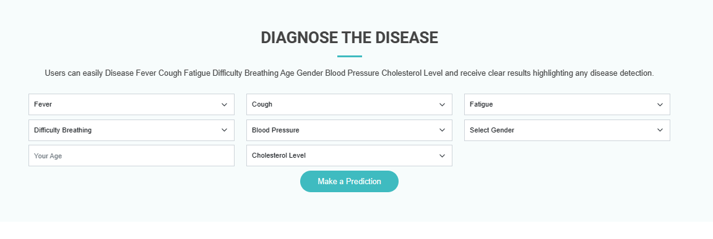

  

## Introduction

## Disease Prediction Web Application
Overview
This project is a web application developed using Flask, a Python web framework, to manage patient records and provide disease predictions based on symptoms and demographic information. The application allows users to add new patients, view a list of existing patients, and make disease predictions using a trained Decision Tree model.

## Features
Patient Management: Add new patients to the database with details such as patient ID, first name, last name, email, and profession.

Database Integration: Utilizes SQLite and SQLAlchemy for efficient storage and retrieval of patient records.

Decision Tree Model: Trains a Decision Tree classifier using a dataset with symptoms and demographic information to predict diseases.

Web Interface: Provides a user-friendly web interface for interacting with the application.

Prediction Endpoint: Allows users to input symptoms and demographic details through a form to receive disease predictions.

## Project Structure
app.py: The main Flask application file containing route definitions and model integration.

models.py: Defines the SQLAlchemy model for the Patient class.

templates/: Contains HTML templates for different pages in the application.

decision_tree_model.pkl: Serialized Decision Tree model saved using the pickle module.

patient_data.xlsx: Excel file for storing patient data.

## Getting Started
To run the application locally:

Clone the repository: git clone https://github.com/umairchanna57/Disease-Prediction.git
Install dependencies: pip install -r requirements.txt
Run the Flask application: python app.py
Access the application in your web browser: http://localhost:5000/
Dependencies
Flask
SQLAlchemy
scikit-learn
pandas